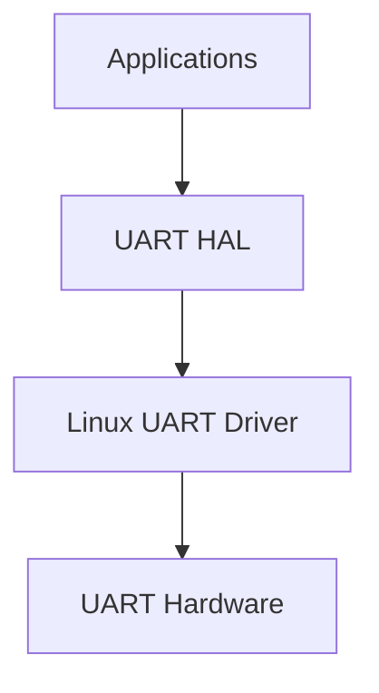

# Serial Stack

A modular UART communication stack, written in C, for Linux-based embeded systems. 

**Goal:** Designing and implementing a complete communication protocol over UART including framing, integrity, verification, reliable-delivery and multi-node communication. 

**Current Status:** UART Hardware Abstraction Layer

**Features:** UART Hardware Abstraction, initialization and configuration; raw byte transmission and reception, basic sender and receriver application. 

**Up-coming Features:** Packet framing, CRC Error Detection

**Architecture Overview:**


**Build:**
Compile using the provided Makefile.

```bash
make
```

**Running:**
Start the receiver on one Raspberry Pi. 

```bash
./receiver
```

Start the sender on the second Raspberry Pi.

```bash
./sender
```

The sender tramsmits raw byte stream over UART and the receiver reads and prints received bytes.

**Hardware:**
Current development platform:

* Raspberry Pi 4 (currently tested with two boards)
* Raspberry Pi OS (Linux)
* UART configured for:
    * 115200 baud
    * 8N1
* GPIO TX/RX connection

**Documentation:**

* **README.md** — Project overview
* **ARCHITECTURE.md** — Software architecture and component organization

