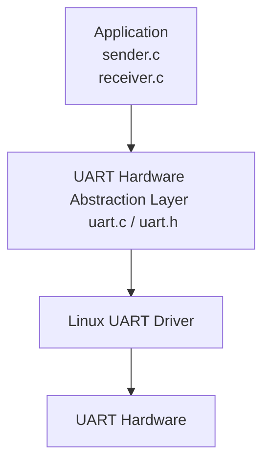
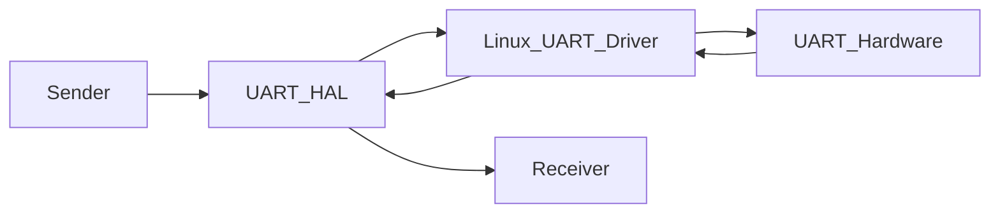

# SerialStack Architecture
---
## Overview

SerialStack, currently, provides Hardware Abstraction Layer for UART communication on Linux. The implementation has interface for transmitting and receiving raw bytes over serial communication. The overall project is aimed at creating a UART-based communication protocol stack over multiple sprints. 

The objective of this stage is to build a stable and resuable edifice upon which other UART-based protocol stack will be built. 
---
## Design Goals

The architecture follows following principles:

- Separation of concerns
- Hardware abstraction
- Layered design
- Minimal public interface
- Scalability for future protocol layers

Implementation is isolated from application logic, such that future functionality can be added without modifying UART layer.


---
## Component Responsibilities 

### Applications

Current Applications:

- sender.c
- receiver.c 

Responsibilities: 

- Open UART device 
- Send raw bytes
- Receive raw bytes
- Display received data

This layer doesn't perform UART configuration and doesn't interact with Linux system calls.

### UART Hardware Abstrcation Layer

This is interface for serial communication.

Public interface:

- `uart_open()`
- `uart_close()`
- `uart_read()`
- `uart_write()`

Responsibilities:

- Configure UART devices
- Open and close UART devices 
- Read bytes
- Write bytes

This layer doesn't know about packets, message formats, CRCs, acks, or protocol state. 

### Linux UART Driver

This component is external to project. This is responsible for transferring bytes between user-space and UART devices; limited to orchestrating transmission and reception of serial bits via hardware. 

### UART Hardware

Raspberry Pi UART peripheral connection through GPIO TX, RX, GND or USB-TTL adapter.  This is responsible for physical transmission and reception of serial bits. 

---

## Data Flow

Data flow is illustrated in the following diagram:


---

## Repository Structure 

```text
SerialStack/

include/
    uart.h

src/
    uart.c

apps/
    sender.c
    receiver.c

/docs
    ARCHITECTURE.md
    wiring-diagram.md

    hardware/images/
        uart-hardware-setup.png

README.md
Makefile
```

---

## Current Limitations

Following features are not implemented: 

- Packet framing
- Length fields
- Message types
- CRC
- Sequence numbers
- ACK/NACK
- Fragmentation
- Reliable delivery

## Next Architectural Milestone

Addition of Packet construction, packet parsing and protocol management while continuing to use existing UART interface. 

