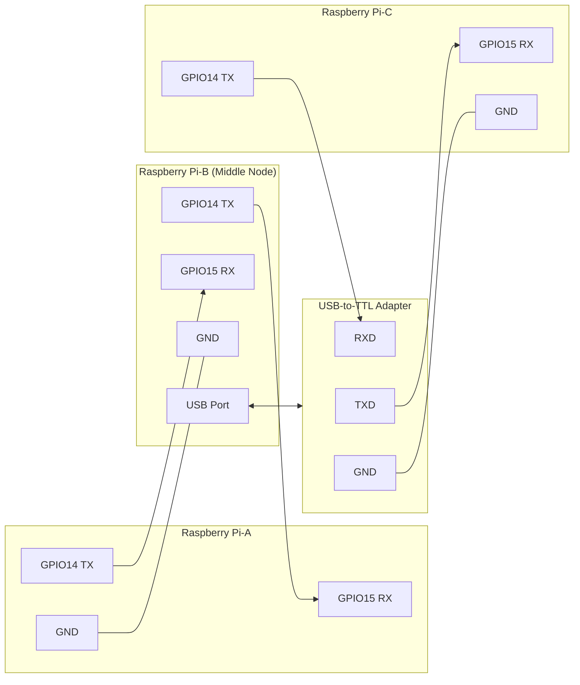

# Wiring

```mermaid
flowchart LR

    subgraph PiA["Raspberry Pi-A"]
        A_TX["GPIO14 TX"]
        A_RX["GPIO15 RX"]
        A_GND["GND"]
    end

    subgraph PiB["Raspberry Pi-B (Middle Node)"]
        B_TX["GPIO14 TX"]
        B_RX["GPIO15 RX"]
        B_GND["GND"]
        USB["USB Port"]
    end

    subgraph USBTTL["USB-to-TTL Adapter"]
        TTL_TX["TXD"]
        TTL_RX["RXD"]
        TTL_GND["GND"]
    end

    subgraph PiC["Raspberry Pi-C"]
        C_TX["GPIO14 TX"]
        C_RX["GPIO15 RX"]
        C_GND["GND"]
    end

    A_TX --> B_RX
    B_TX --> A_RX
    A_GND --- B_GND

    USB <--> USBTTL

    TTL_TX --> C_RX
    C_TX --> TTL_RX
    TTL_GND --- C_GND
```
